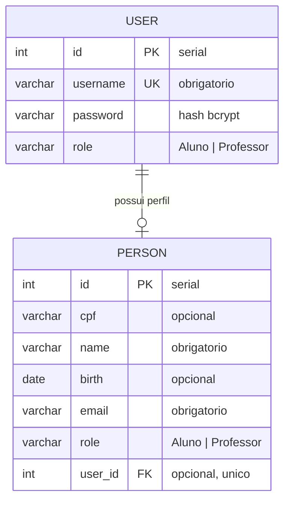

# API Auth

API de autenticacao e autorizacao de usuarios desenvolvida com Fastify, TypeScript, JWT, TypeORM e PostgreSQL.

## Sumario

- [Visao geral](#visao-geral)
- [Tecnologias](#tecnologias)
- [Requisitos](#requisitos)
- [Configuracao](#configuracao)
- [Execucao](#execucao)
- [Banco de dados](#banco-de-dados)
- [Diagrama de entidades](#diagrama-de-entidades)
- [Autenticacao](#autenticacao)
- [Rotas da aplicacao](#rotas-da-aplicacao)
- [Contratos da API](#contratos-da-api)
- [Testes](#testes)
- [Docker](#docker)
- [Estrutura do projeto](#estrutura-do-projeto)

## Visao Geral

O sistema expoe uma API HTTP para:

- criar usuarios com senha criptografada;
- vincular dados complementares de pessoa ao usuario;
- autenticar usuarios com `username` e `password`;
- gerar token JWT;
- proteger rotas privadas com Bearer Token;
- retornar os dados do usuario autenticado pelo token JWT;
- consultar dados de usuario autenticado por ID ou por nome parcial.
- consultar multiplos usuarios por lista de IDs em uma unica chamada.

As rotas publicas sao:

- `POST /user`
- `POST /user/signin`

A rota privada atual e:

- `GET /user/whoami`
- `GET /user?role=Aluno|Professor`
- `GET /user/:identifier`
- `GET /users?ids=10,25,30`

## Tecnologias

- Node.js
- TypeScript
- Fastify
- TypeORM
- PostgreSQL
- JWT com `@fastify/jwt`
- Zod
- Bcrypt

## Requisitos

- Node.js 22 ou superior
- npm
- Docker e Docker Compose, se for usar banco via container
- PostgreSQL 16, se for rodar o banco localmente sem Docker

## Configuracao

Crie um arquivo `.env` na raiz do projeto com base no `.env.example`.

Exemplo:

```env
PORT=3000
NODE_ENV=development
DATABASE_USER=postgres
DATABASE_HOST=localhost
DATABASE_NAME=api_auth
DATABASE_PASSWORD=postgres
DATABASE_PORT=5432
JWT_SECRET=segredo_local
```

Variaveis obrigatorias:

| Variavel | Descricao |
| --- | --- |
| `PORT` | Porta HTTP da API. |
| `NODE_ENV` | Ambiente da aplicacao: `development`, `production` ou `test`. |
| `DATABASE_USER` | Usuario do PostgreSQL. |
| `DATABASE_HOST` | Host do PostgreSQL. Em Docker Compose, use o nome do servico quando a API tambem estiver em container. |
| `DATABASE_NAME` | Nome do banco de dados. |
| `DATABASE_PASSWORD` | Senha do PostgreSQL. |
| `DATABASE_PORT` | Porta do PostgreSQL. |
| `JWT_SECRET` | Segredo usado para assinar e validar tokens JWT. |

## Execucao

Instale as dependencias:

```bash
npm install
```

Suba o PostgreSQL com Docker Compose:

```bash
docker compose up -d
```

Execute as migrations:

```bash
npm run migration:run
```

Inicie a API em desenvolvimento:

```bash
npm run dev
```

URL padrao:

```text
http://localhost:3000
```

## Scripts

| Comando | Descricao |
| --- | --- |
| `npm run dev` | Inicia a API com `tsx src/server.ts`. |
| `npm run build` | Compila TypeScript para a pasta `dist`. |
| `npm run migration:run` | Executa as migrations configuradas no TypeORM. |
| `npm test` | Executa o roteiro de testes em `test/app.test.js`. |

## Banco de Dados

O projeto usa PostgreSQL com TypeORM.

Tabelas principais:

### `user`

| Campo | Tipo | Observacao |
| --- | --- | --- |
| `id` | serial | Chave primaria. |
| `username` | varchar | Obrigatorio e unico. |
| `password` | varchar | Hash da senha. |
| `role` | varchar | Deve ser `Aluno` ou `Professor`. |

### `person`

| Campo | Tipo | Observacao |
| --- | --- | --- |
| `id` | serial | Chave primaria. |
| `cpf` | varchar | CPF da pessoa. |
| `name` | varchar | Nome da pessoa. |
| `birth` | date | Data de nascimento. |
| `email` | varchar | E-mail. |
| `role` | varchar | Deve ser `Aluno` ou `Professor`. |
| `user_id` | integer | Referencia opcional e unica para `user.id`. |

No DER atual, `name` e `email` sao obrigatorios no cadastro da API. `cpf` e `birth` sao opcionais.

As migrations ficam em:

```text
src/lib/typeorm/migrations
```

Tambem existe um script SQL para execucao manual das migrations:

```text
docs/manual-migrations.sql
```

Exemplo de execucao manual com `psql`:

```bash
psql -h localhost -p 5432 -U postgres -d api_auth -f docs/manual-migrations.sql
```

## Diagrama de Entidades



### Regras do Modelo

- `user.id` e a chave primaria da tabela `"user"`.
- `user.username` e unico e usado no login.
- `user.password` armazena o hash da senha, nao a senha em texto puro.
- `user.role` aceita apenas `Aluno` ou `Professor`.
- `person.id` e a chave primaria da tabela `person`.
- `person.user_id` referencia `user.id`, pode ser nulo e e unico quando preenchido.
- A consulta `GET /user/:identifier` faz `LEFT JOIN` entre `"user"` e `person`, usando `person.user_id = user.id`.
- Quando existe registro em `person`, a API prioriza `person.role`; caso contrario, usa `user.role`.
- Quando `identifier` e numerico, a busca e por `user.id`.
- Quando `identifier` e texto, a busca e por nome parcial em `person.name`.

### Relacionamento

O relacionamento atual permite que um usuario tenha zero ou um registro complementar em `person`.

Na pratica:

- um usuario pode existir apenas na tabela `"user"`;
- um usuario pode ter dados complementares em `person`;
- `person.user_id` e opcional, entao tambem podem existir registros de pessoa ainda nao vinculados a um usuario.

## Autenticacao

O login retorna um JWT. Para acessar rotas privadas, envie o token no header:

```http
Authorization: Bearer <token>
```

O token inclui:

- `sub`: ID do usuario;
- `username`: nome de usuario;
- `role`: papel do usuario.

As roles aceitas sao:

- `Aluno`
- `Professor`

## Rotas da Aplicacao

| Metodo | Rota | Autenticacao | Descricao |
| --- | --- | --- | --- |
| `POST` | `/user` | Publica | Cria um usuario e seu registro em `person`. |
| `POST` | `/user/signin` | Publica | Autentica um usuario e retorna JWT. |
| `GET` | `/user?role=Aluno|Professor` | Bearer Token | Lista usuarios, com filtro opcional por role. |
| `GET` | `/user/whoami` | Bearer Token | Retorna o usuario autenticado pelo token JWT. |
| `GET` | `/user/:identifier` | Bearer Token | Busca usuario por ID numerico ou por nome parcial. |
| `GET` | `/users?ids=...` | Bearer Token | Busca multiplos usuarios por IDs. |

## Contratos da API

### Criar Usuario

```http
POST /user
Content-Type: application/json
```

Body:

```json
{
  "username": "maria",
  "password": "123456",
  "role": "Aluno",
  "name": "Maria",
  "email": "maria@example.com",
  "cpf": "00000000000",
  "birth": "2000-01-01"
}
```

Resposta `201`:

```json
{
  "id": 1,
  "username": "maria",
  "role": "Aluno",
  "cpf": "00000000000",
  "name": "Maria",
  "birth": "2000-01-01T00:00:00.000Z",
  "email": "maria@example.com",
  "user_id": 1
}
```

O cadastro cria um registro em `"user"` e um registro em `person`, vinculando `person.user_id = user.id`.

Campos obrigatorios:

- `username`
- `password`
- `role`
- `name`
- `email`

Campos opcionais:

- `cpf`
- `birth`

Exemplo com `curl`:

```bash
curl -X POST http://localhost:3000/user \
  -H "Content-Type: application/json" \
  -d '{"username":"maria","password":"123456","role":"Aluno","name":"Maria","email":"maria@example.com","cpf":"00000000000","birth":"2000-01-01"}'
```

### Login

```http
POST /user/signin
Content-Type: application/json
```

Body:

```json
{
  "username": "maria",
  "password": "123456"
}
```

Resposta `200`:

```json
{
  "token": "<jwt>",
  "role": "Aluno"
}
```

O campo `role` retornado usa `person.role` quando houver pessoa vinculada; caso contrario usa `user.role`. O token JWT tambem carrega `username` e `role`, com `sub` apontando para o ID do usuario.

Exemplo com `curl`:

```bash
curl -X POST http://localhost:3000/user/signin \
  -H "Content-Type: application/json" \
  -d '{"username":"maria","password":"123456"}'
```

### Usuario Autenticado

```http
GET /user/whoami
Authorization: Bearer <token>
```

A rota usa o `sub` do JWT para buscar o usuario autenticado.

Resposta `200`:

```json
{
  "id": 1,
  "username": "maria",
  "name": "Maria",
  "email": "maria@example.com",
  "role": "Aluno"
}
```

Exemplo com `curl`:

```bash
curl http://localhost:3000/user/whoami \
  -H "Authorization: Bearer <token>"
```

### Listar Usuarios

```http
GET /user
Authorization: Bearer <token>
```

Retorna todos os usuarios registrados/criados, sem senha ou campos sensiveis.
O parametro opcional `role` filtra os usuarios por `Aluno` ou `Professor`.

Resposta `200`:

```json
[
  {
    "id": 1,
    "username": "maria",
    "role": "Aluno",
    "cpf": "00000000000",
    "name": "Maria",
    "birth": "2000-01-01",
    "email": "maria@example.com",
    "user_id": 1
  }
]
```

Exemplo com `curl`:

```bash
curl http://localhost:3000/user \
  -H "Authorization: Bearer <token>"
```

Exemplo filtrando professores:

```bash
curl "http://localhost:3000/user?role=Professor" \
  -H "Authorization: Bearer <token>"
```

Uma `role` diferente de `Aluno` ou `Professor` retorna HTTP `400`.

### Buscar Usuario por ID

```http
GET /user/:identifier
Authorization: Bearer <token>
```

Quando `identifier` e numerico, a API busca por `user.id`.

Resposta `200`:

```json
{
  "id": 1,
  "username": "maria",
  "role": "Aluno",
  "cpf": "00000000000",
  "name": "Maria",
  "birth": "2000-01-01",
  "email": "maria@example.com",
  "user_id": 1
}
```

Exemplo com `curl`:

```bash
curl http://localhost:3000/user/1 \
  -H "Authorization: Bearer <token>"
```

### Buscar Usuarios por Nome

```http
GET /user/:identifier
Authorization: Bearer <token>
```

Quando `identifier` e texto, a API busca por nome parcial em `person.name`.

Resposta `200`:

```json
[
  {
    "id": 1,
    "username": "maria",
    "role": "Aluno",
    "cpf": "00000000000",
    "name": "Maria Silva",
    "birth": "2000-01-01",
    "email": "maria@example.com",
    "user_id": 1
  }
]
```

Exemplo com `curl`:

```bash
curl http://localhost:3000/user/Mari \
  -H "Authorization: Bearer <token>"
```

### Buscar Multiplos Usuarios por IDs

```http
GET /users?ids=10,25,30,31
Authorization: Bearer <token>
Accept: application/json
```

A rota recebe `ids` como string com IDs separados por virgula. Ela remove IDs duplicados, limita a 100 IDs por requisicao e retorna apenas usuarios encontrados.

Resposta `200`:

```json
[
  {
    "id": 10,
    "username": "joao.professor",
    "role": "Professor",
    "cpf": "11111111111",
    "name": "Joao Professor Exemplo",
    "birth": "1980-01-01",
    "email": "joao.professor@example.com",
    "user_id": 10
  },
  {
    "id": 25,
    "username": "jose.aluno",
    "role": "Aluno",
    "cpf": "22222222222",
    "name": "Jose Aluno Exemplo",
    "birth": "2005-01-01",
    "email": "jose.aluno@example.com",
    "user_id": 25
  }
]
```

Se nenhum usuario for encontrado, a resposta e `200` com array vazio:

```json
[]
```

Exemplo com `curl`:

```bash
curl -X GET "http://localhost:3000/users?ids=10,25,30,31" \
  -H "accept: application/json" \
  -H "Authorization: Bearer <token>"
```

Validacoes:

- `ids` e obrigatorio.
- Cada ID deve ser numerico e maior que zero.
- IDs duplicados sao removidos antes da busca.
- O limite maximo e 100 IDs por requisicao.
- Senha e outros campos sensiveis nao sao retornados.

## Respostas de Erro

### Token ausente ou invalido

Status `401`:

```json
{
  "message": "Unauthorized"
}
```

### Credenciais invalidas

Status `401`:

```json
{
  "message": "Username or password is incorrect"
}
```

### Recurso nao encontrado

Status `404`:

```json
{
  "message": "Resource not found"
}
```

### Erro de validacao

Status `400`:

```json
{
  "message": "Validation error",
  "issues": {
    "field": ["mensagem do erro"]
  }
}
```

### Erro interno

Status `500`:

```json
{
  "message": "Internal server error"
}
```

## Testes

O roteiro de testes da API fica em:

```text
test/app.test.js
```

Executar:

```bash
npm test
```

Os testes validam:

- criacao de usuario;
- login;
- rejeicao de credenciais invalidas;
- protecao de rota privada;
- retorno do usuario autenticado com `/user/whoami`;
- listagem autenticada de todos os usuarios;
- filtro e validacao da listagem de usuarios por role;
- busca autenticada de usuario;
- busca autenticada de usuarios por nome parcial;
- busca autenticada de multiplos usuarios por IDs;
- resposta `404` para usuario inexistente.

## Docker

Build da imagem:

```bash
docker build -f docker/Dockerfile -t api-auth .
```

Executar a API em container:

```bash
docker run --env-file .env -p 3000:3000 api-auth
```

Subir PostgreSQL e pgAdmin:

```bash
docker compose up -d
```

Servicos do `docker-compose.yml`:

| Servico | Porta | Descricao |
| --- | --- | --- |
| `postgres` | `5432` | Banco PostgreSQL 16. |
| `pgadmin` | `8080` | Interface web para administrar o banco. |

## Estrutura do Projeto

```text
src/
  app.ts                         # configuracao do Fastify, JWT, hooks e rotas
  server.ts                      # inicializacao HTTP e TypeORM
  env/                           # validacao das variaveis de ambiente
  entities/                      # entidades TypeORM
  http/controllers/user/         # rotas e controllers de usuario
  http/middlewares/              # middleware de validacao JWT
  lib/typeorm/                   # datasource e migrations
  repositories/                  # contratos e implementacoes de persistencia
  use-cases/                     # regras de negocio
test/
  app.test.js                    # roteiro de testes da API
docker/
  Dockerfile                     # imagem da aplicacao
```
